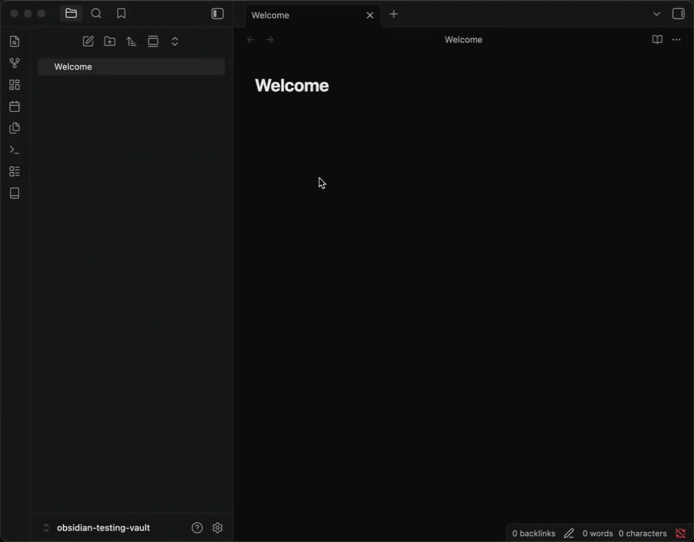

# Obsidian Quran Inserter Plugin

An Obsidian plugin that allows you to quickly fetch and insert Quranic verses directly into your Markdown notes using the [Al Quran Cloud API](https://alquran.cloud/api).

## Features

- **Quick Insert**: Search for any verse using the standard `surah:verse` format (e.g., `2:255` for Ayat al-Kursi).
- **Command Palette Support**: Trigger the "Insert verse" command using `Ctrl/Cmd + P`.
- **Hotkey Support**: Trigger the "Insert verse" command using a hotkey.
- **Smart Placement**: Inserts text at your current cursor position, handling line breaks automatically.

## Showcase

 

## How to Use

1. Click the **Book Icon** in the ribbon or use the command palette (`Ctrl/Cmd + P`) and search for **Insert verse**.
2. A modal will appear asking for the verse reference.
3. Enter the reference in `surah:verse` format (e.g., `18:10`).
4. Press **Enter** or click **Insert**.
5. The verse will be fetched and inserted into your current note.

## Installation

### From Community Plugins (Recommended)
*Pending addition to the Obsidian Community Plugins list.*

### Manual Installation
1. Download `main.js`, `manifest.json` & `style.css` from the latest [release](https://github.com/ramysami/obsidian-quran-plugin/releases/latest).
2. Create a folder named `quran-inserter` in your vault's `.obsidian/plugins/` directory.
3. Move the downloaded files into that folder.
4. Reload Obsidian and enable the plugin in **Settings > Community plugins**.

## Development

If you want to build the plugin yourself:

1. Clone this repository.
2. Run `npm install` to install dependencies.
3. Run `npm run dev` to start the build process in watch mode or `npm run build` to build the plugin.

## Planned features
- [ ] Insert tafsir/translation.
- [ ] Insert multiple verses.
- [x] Link to the verse on Quran.com.
- [ ] Settings page.
---

*Note: This plugin requires an active internet connection to fetch verses from the Al Quran Cloud API.*

*Inspired by [Malik Safwan](https://x.com/safwanmalikkk/status/2045142031224517084).*
